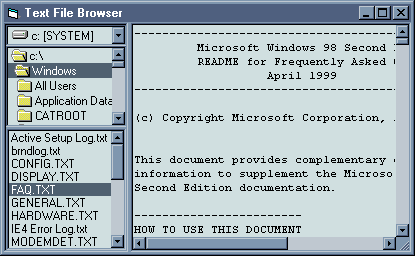



## EBSplitter

### Description

EBSplitter is an easy to use splitter control. Animation is smooth, and the control comes complete with a demo text file browser to show off some of its features.
 
### More Info
 

             |
---                |---
**Submitted On**   |2001-06-22 14:46:54
**By**             |[Richard@Home](https://github.com/Planet-Source-Code/PSCIndex/blob/master/ByAuthor/richard-home.md)
**Level**          |Intermediate
**User Rating**    |4.1 (29 globes from 7 users)
**Compatibility**  |VB 6\.0
**Category**       |[Custom Controls/ Forms/  Menus](https://github.com/Planet-Source-Code/PSCIndex/blob/master/ByCategory/custom-controls-forms-menus__1-4.md)
**World**          |[Visual Basic](https://github.com/Planet-Source-Code/PSCIndex/blob/master/ByWorld/visual-basic.md)
**Archive File**   |[EBSplitter215036222001\.zip](https://github.com/Planet-Source-Code/richard-home-ebsplitter__1-24316/archive/master.zip)

